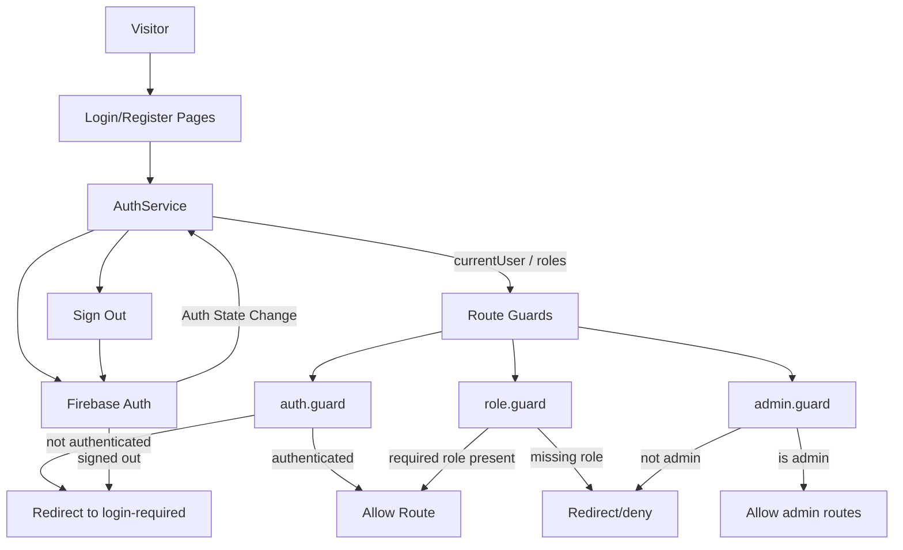

# Brookes Puppy Plan - Auth Flow

```mermaid
flowchart TD
  V[Visitor] --> LOGIN[Login/Register Pages]
  LOGIN --> AUTHSVC[AuthService]
  AUTHSVC --> FAUTH[Firebase Auth]

  FAUTH -->|Auth State Change| AUTHSVC
  AUTHSVC -->|currentUser / roles| GUARDS[Route Guards]

  GUARDS --> AG[auth.guard]
  GUARDS --> RG[role.guard]
  GUARDS --> ADG[admin.guard]

  AG -->|authenticated| ROUTE_OK[Allow Route]
  AG -->|not authenticated| ROUTE_LOGIN[Redirect to login-required]

  RG -->|required role present| ROUTE_OK
  RG -->|missing role| ROUTE_DENY[Redirect/deny]

  ADG -->|is admin| ADMIN_OK[Allow admin routes]
  ADG -->|not admin| ROUTE_DENY

  AUTHSVC --> SIGNOUT[Sign Out]
  SIGNOUT --> FAUTH
  FAUTH -->|signed out| ROUTE_LOGIN
```
