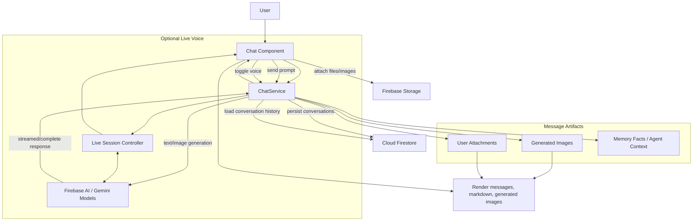

# Brookes Puppy Plan - Chat Flow

## Code Links

- Chat component logic: [src/app/chat/chat.ts](../../src/app/chat/chat.ts)
- Chat template: [src/app/chat/chat.html](../../src/app/chat/chat.html)
- Chat styles: [src/app/chat/chat.css](../../src/app/chat/chat.css)
- Chat service: [src/app/chat/chat.service.ts](../../src/app/chat/chat.service.ts)
- Firebase config used by chat: [src/app/firebase.ts](../../src/app/firebase.ts)
