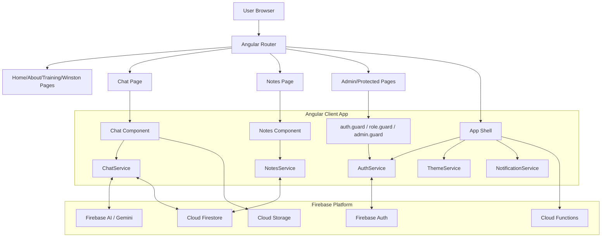

# Brookes Puppy Plan - High Level Architecture

```mermaid
flowchart TB
  U[User Browser] --> R[Angular Router]
  R --> P1[Home/About/Training/Winston Pages]
  R --> P2[Chat Page]
  R --> P3[Notes Page]
  R --> P4[Admin/Protected Pages]

  subgraph Client[Angular Client App]
    APP[App Shell]
    AUTHSVC[AuthService]
    THEMESVC[ThemeService]
    NOTIFSVC[NotificationService]
    CHATCMP[Chat Component]
    CHATSVC[ChatService]
    NOTESCMP[Notes Component]
    NOTESSVC[NotesService]
    GUARDS[auth.guard / role.guard / admin.guard]
  end

  R --> APP
  APP --> AUTHSVC
  APP --> THEMESVC
  APP --> NOTIFSVC
  P2 --> CHATCMP --> CHATSVC
  P3 --> NOTESCMP --> NOTESSVC
  P4 --> GUARDS

  subgraph Firebase[Firebase Platform]
    FAUTH[Firebase Auth]
    FSTORE[Cloud Firestore]
    FSTOR[Cloud Storage]
    FCF[Cloud Functions]
    FAI[Firebase AI / Gemini]
  end

  AUTHSVC <--> FAUTH
  GUARDS --> AUTHSVC
  NOTESSVC <--> FSTORE
  CHATCMP --> FSTOR
  CHATSVC <--> FAI
  CHATSVC <--> FSTORE
  APP --> FCF
```
