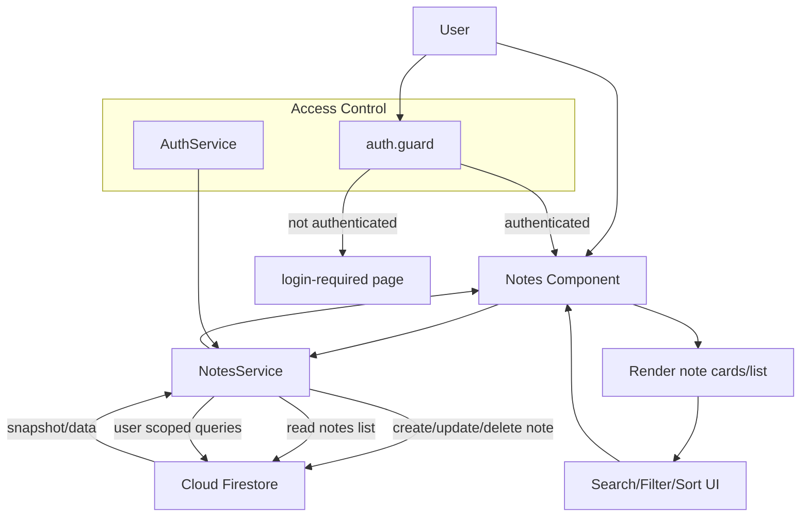

# Brookes Puppy Plan - Notes Flow

```mermaid
flowchart TD
  U[User] --> NC[Notes Component]
  NC --> NS[NotesService]

  NS -->|create/update/delete note| DB[Cloud Firestore]
  NS -->|read notes list| DB
  DB -->|snapshot/data| NS
  NS --> NC

  NC --> UI[Render note cards/list]
  UI --> FILTER[Search/Filter/Sort UI]
  FILTER --> NC

  subgraph Access Control
    AUTH[AuthService]
    GUARD[auth.guard]
  end

  U --> GUARD
  GUARD -->|authenticated| NC
  GUARD -->|not authenticated| LOGIN[login-required page]

  AUTH --> NS
  NS -->|user scoped queries| DB
```
